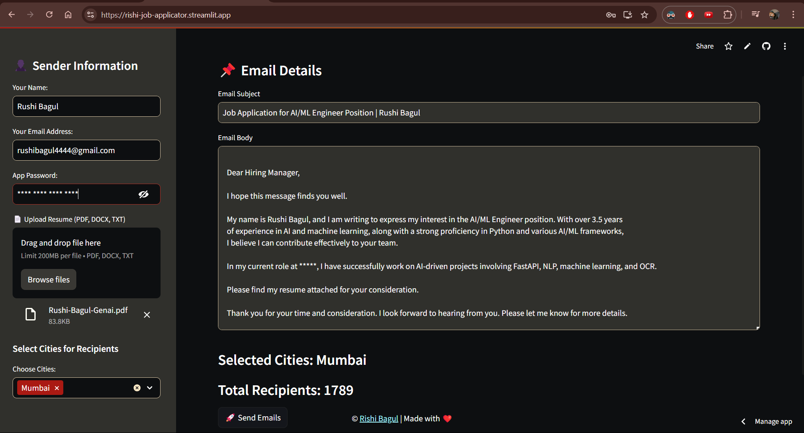

# Automated Email Sender 📧 by - <span style="color:blue">**Rishi Bagul**</span>.

This is a Python application built with **Streamlit** to automate sending emails with attachments. The application allows you to upload a CSV/Excel file with recipient emails, choose categories (e.g., cities), and send personalized emails along with attachments (e.g., resumes). The sender's email and app password are retrieved from environment variables, and the app integrates with Gmail's SMTP server.

## 📢Demo App with Streamlit Cloud

[Job Applicator Site](https://rishi-job-applicator.streamlit.app/)

## 💻 Demo:


## Table of Contents

1. [Requirements](#requirements)
2. [Setup](#setup)
   - [Create App Password](#create-app-password)
   - [Set Up .env File](#set-up-env-file)
3. [Filesystem Structure](#project-file-system-tree-structure)
4. [Running the Application](#running-the-application)
5. [Application Structure](#application-structure)
   - [Main Components](#main-components)
   - [How to Use](#how-to-use)
6. [Code Explanation](#code-explanation)

---

## Requirements

1. Python 3.x
2. Streamlit
3. Pandas
4. OpenAI API (Optional for template)
5. `python-dotenv`
6. `smtplib`

### Install Dependencies

To install all required dependencies, run the following command:

```bash
pip install -r requirements.txt
```

---

## Setup

### Create App Password

To use Gmail's SMTP server, you need to create an **App Password**. Follow these steps:

1. **Enable 2-Step Verification** for your Google account:  
   Go to [Google Account](https://myaccount.google.com/security) > **2-Step Verification** > Turn on.

2. **Create an App Password**:  
   - After enabling 2-step verification, go to [App Passwords](https://myaccount.google.com/apppasswords).
   - Under "Select App", choose **Mail** and under "Select Device", choose **Other**.
   - Enter a custom name (e.g., "Automated Email Sender") and click **Generate**.
   - Copy the generated app password (a 16-character password).

3. **Save the App Password** in your `.env` file (explained below).

### Set Up .env File

Create a `.env` file in the project directory and add the following:

```plaintext
EMAIL_ADDRESS=your-email@gmail.com
APP_PASSWORD=your-app-password
```

Replace `your-email@gmail.com` and `your-app-password` with your actual Gmail email and app password.

---

## Running the Application

To run the application locally:

1. Ensure you have installed all dependencies by running:
   ```bash
   pip install -r requirements.txt
   ```

2. Run the Streamlit app with this command:
   ```bash
   streamlit run ApplicationApp.py
   ```

This will launch the app in your default web browser.


## Project File System Tree Structure

```
Job-applicator-from-mailids/
├── README.md
├── requirements.txt
├── ApplicationApp.py
├── .env
├── data/
│    ├──Mail_id.xlsx [If not present request on mail]
|    └──resume.pdf
├── mail_template/
│   └── User_data.py
└── .gitignore

```

## Application Structure

### Main Components

1. **File Upload**:
   - The sidebar allows users to upload a CSV or Excel file with recipient emails. Each file should contain columns representing cities or categories, with each row containing email addresses for those cities.

   Example format (CSV or Excel):

   |     Pune      |    Mumbai     |   Banglore    |
   |---------------|---------------|---------------|
   | email1@xyz.com| email2@xyz.com| email3@xyz.com|
   | email4@xyz.com| email5@xyz.com| email6@xyz.com|

2. **Sender Information**:
   - The sidebar collects the sender's email and app password. The app uses these credentials to log in to Gmail's SMTP server to send emails.

3. **Email Details**:
   - On the main page, users can input the email subject and body.
   - The email can also have an attachment, such as a resume, which is uploaded via the file uploader in the sidebar.

4. **Send Email**:
   - The app sends an email to the selected recipients (from the CSV/Excel file) using Gmail's SMTP service. The email is sent with the subject, body, and attached file.

### How to Use

1. **Upload Excel/CSV**: Upload a CSV or Excel file containing recipient emails grouped by cities or categories.
   
   Example format (CSV or Excel):

   |     Pune      |    Mumbai     |   Banglore    |
   |---------------|---------------|---------------|
   | email1@xyz.com| email2@xyz.com| email3@xyz.com|
   | email4@xyz.com| email5@xyz.com| email6@xyz.com|

2. **Sender Email & App Password**:
   - Enter the **sender email address** (your Gmail address).
   - Enter the **App Password** generated from your Google account (see instructions above).

3. **Upload Resume**:
   - Upload a PDF, DOCX, or TXT file (such as your resume) that will be sent as an attachment.

4. **Email Subject & Body**:
   - Enter the subject and body of your email.

5. **Send Emails**:
   - After filling all the required fields, click **Send Emails** to send the email to the recipients.

---

## Code Explanation

### Key Sections of Code:

1. **Environment Variables**:
   - The `EMAIL_ADDRESS` and `APP_PASSWORD` are loaded from a `.env` file using the `python-dotenv` package. These credentials are used for logging into the Gmail SMTP server.

   ```python
   load_dotenv()
   EMAIL_ADDRESS = os.environ.get("EMAIL_ADDRESS")
   APP_PASSWORD = os.environ.get("APP_PASSWORD")
   ```

2. **CSV/Excel File Upload**:
   - Users can upload either a CSV or Excel file containing recipient emails. The `GetRecipients` function processes the uploaded file, extracts email addresses from selected cities/categories, and stores them in a list.

   ```python
   file = st.sidebar.file_uploader("Upload Excel or CSV File with Emails", type=["xlsx", "csv"])
   ```

3. **Sending Emails**:
   - The app uses Python's `smtplib` to connect to Gmail's SMTP server. The email is composed using the `EmailMessage` class, and the resume file is attached using the `add_attachment()` method.

   ```python
   msg = EmailMessage()
   msg["From"] = sender_email
   msg["To"] = sender_email
   msg["Bcc"] = ", ".join(BCC_EMAILS)
   msg["Subject"] = subject
   msg.set_content(body)
   msg.add_attachment(resume_file.read(), maintype="application", subtype="pdf", filename=resume_file.name)
   ```

4. **Error Handling**:
   - The app checks if all required inputs are provided before sending the email. If any input is missing, it shows an error message.

   ```python
   if not sender_email or not app_password or not resume_file or not BCC_EMAILS:
       st.error("⚠️ Please provide all required inputs.")
   ```

---

## License

This project is licensed under the MIT License - see the [LICENSE](LICENSE) file for details.
